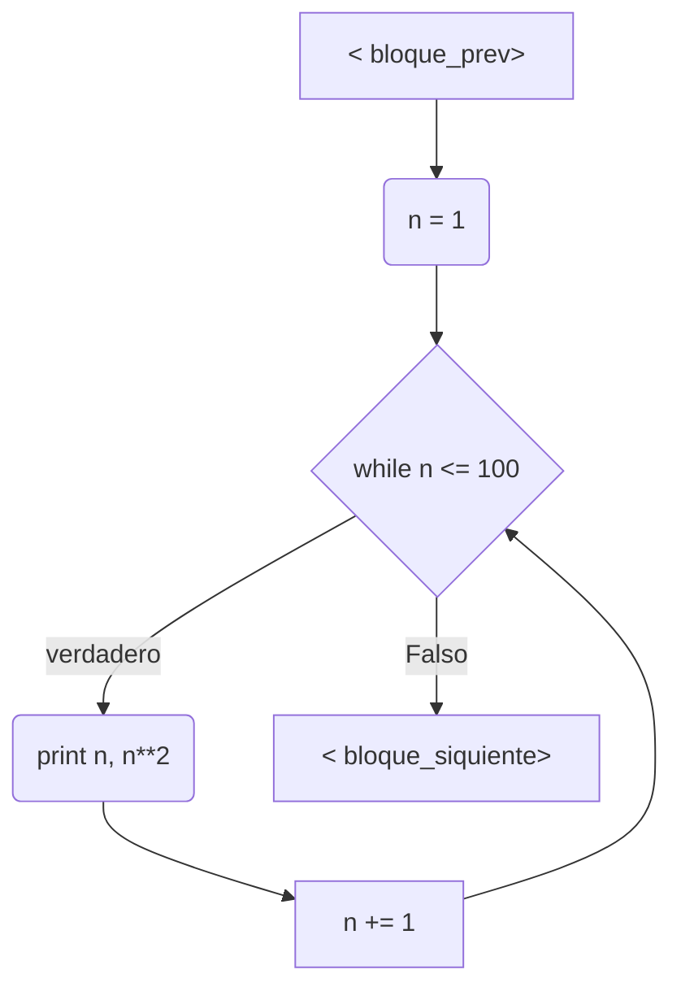
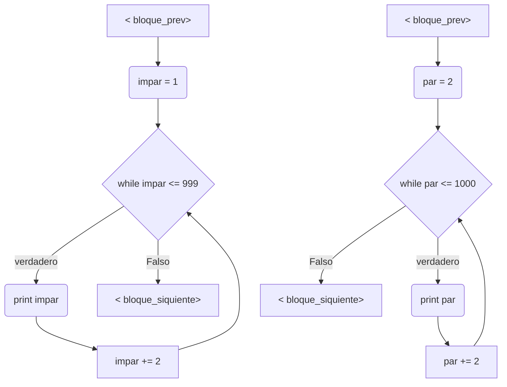
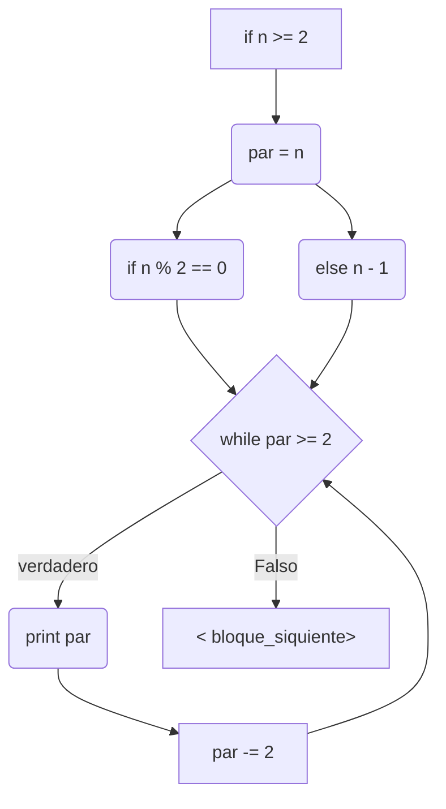

# Reto_6
Elaborado por: Maria Fernanda Parra Osorio_1014980661  
Este reto se realizó en un notebook el cual está adjuntado en el repositorio
## Diagramas de Flujo 
Se realizaron diagramas de flujo para los tres primeros ejercicios
#### Ejercicio 1

#### Ejercicio 2

#### Ejercicio 3

